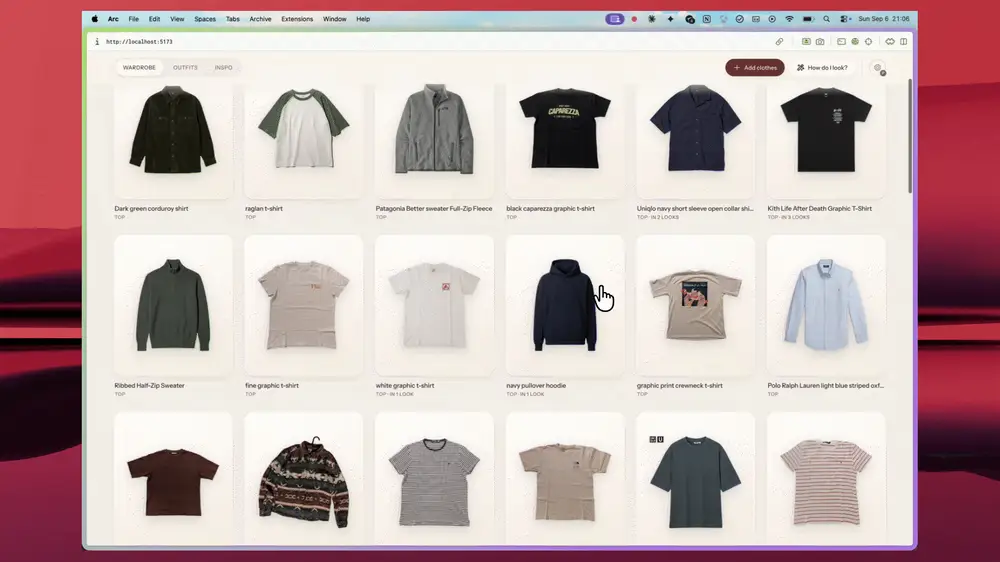
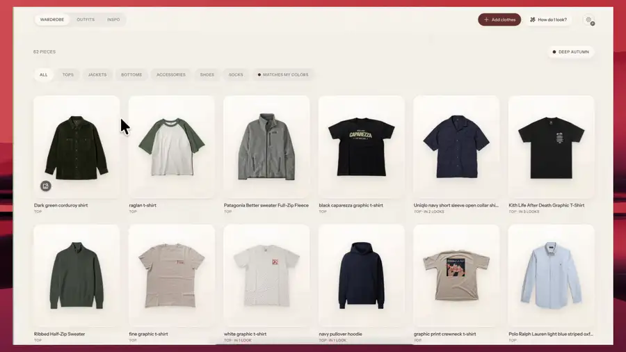
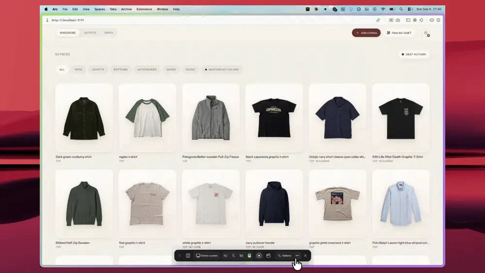
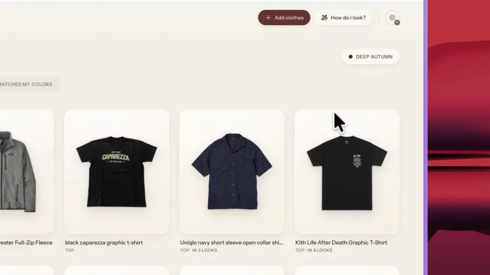

<div align="center">

# Wardrobe

Your clothes, extracted and organized with AI.

[](LICENSE)
[](package.json)

[See the original post →](https://x.com/cdngdev/status/2076812846793650485)

</div>

## About the original project

This is a fork of [tandpfun/wardrobe](https://github.com/tandpfun/wardrobe), a local-first app with a simple idea: drop in a photo of a clothing item, let AI cut it out into a clean product shot, and generate an editorial photo of you wearing it. Everything — originals, cutouts, and the wardrobe database — stays on your machine.


The original does three things well:

- Detects every garment in a photo with an AI vision model
- Extracts a clean product cutout from it
- Generates an optional modeled editorial preview of you wearing it

Full credit to [@cdngdev](https://x.com/cdngdev) for the original idea and implementation — this fork builds on top of it.

## What this fork adds

The core import pipeline above is still here, but this fork turns it into a full styling app.

**Style tools**

- **Outfits** — combine wardrobe pieces (top, bottom, jacket, shoes, socks, accessory) into saved looks, previewed as a flat lay that reveals a scattered editorial layout on hover. Generate a modeled photo of the full outfit, in Standard or Premium quality, and refine it with a free-text note ("jacket should be darker") to regenerate.
- **Suggest outfits** — pick an occasion (casual, work, date, sport, event) and get 3–5 AI-generated combinations pulled from your own wardrobe, each with reasoning about color harmony, weather, and occasion fit. It factors in live local weather and your style profile from Inspo. One click saves a suggestion as a real outfit.
- **Inspo** — one board for style inspiration and the wishlist pieces detected from it. Paste image URLs or drag in photos from anywhere to save a full look; a "Detect items" action analyzes it and breaks it down into individual garment cutouts. Browse by category — Full Look for the saved photos, or any garment type for the pieces detected out of them.
- **How do I look?** — an AI mirror: upload a photo of yourself actually wearing an outfit and get a fit and color critique, plus swap suggestions pulled from pieces you already own.
- **My Colors** — a quick seasonal color-analysis quiz (undertone + contrast) that assigns you a season palette, refinable by extracting colors from your own photos. Matching wardrobe items get a badge, and it feeds into outfit suggestions.

**AI & providers**

- **Choice of provider** — the original shipped on OpenAI only; this fork adds **OpenRouter**, **Gemini** (with a free tier via Google AI Studio), and **MiniMax** as alternatives, configurable with `AI_PROVIDER`.
- **Gemini TEST/PROD mode** — a header toggle that switches between a free, unbilled key for everyday use and a billed key for higher-quality output, with no restart needed.
- **Face reference photo** — an optional close-up face/shoulders photo, sent alongside the full-body reference to sharpen facial identity across generations.
- **Outfit-level and item-level modeled photos** — Standard vs. Premium quality tiers, with regeneration notes.

**Getting set up**

- **In-dashboard onboarding wizard** — the app walks you through picking a provider, saving your API key, and dropping in a reference photo, right in the browser. No hand-editing `.env` or restarting anything yourself — see [Quick start](#quick-start).
- **Bulk import and agent-driven setup** — a script for importing a whole folder of old photos at once, plus Codex skills for hands-off importing and outfit generation. See [AGENTS.md](AGENTS.md).

## See it in action

Each clip plays on loop below. The full-quality MP4 is linked under each one.

### The wardrobe



<sub>[Full quality MP4 →](docs/screenshots/wardrobe.mp4)</sub>

Every piece you import lands here as a clean cutout on its own card, labeled with its category and how many saved looks it appears in. Filter down to tops, jackets, bottoms, accessories, shoes or socks — or to just the pieces that match your season palette — and open any item to see the original photo it came from, its modeled preview, and the outfits built around it.

### Outfits



<sub>[Full quality MP4 →](docs/screenshots/outfits.mp4)</sub>

Saved looks, each previewed as a flat lay that scatters into an editorial layout on hover. Build one by hand from your own pieces, or hit **Suggest outfit**, pick an occasion, and get AI-generated combinations drawn from your wardrobe with reasoning about color harmony, weather and occasion fit. Any outfit can be rendered as a modeled photo of you wearing the whole look, and refined with a free-text note ("jacket should be darker") to regenerate.

### Inspo and the AI Mirror



<sub>[Full quality MP4 →](docs/screenshots/inspo-howdoilook.mp4)</sub>

**Inspo** is a board for looks you want to steal. Paste a batch of image URLs or drag photos in from anywhere, then run **Detect items** to break a saved look down into individual garment cutouts you can browse by category — the wishlist half of your wardrobe.

**How do I look?** is the AI Mirror: upload a photo of yourself actually wearing an outfit and get a fit and color critique — what's working, what isn't — plus swap suggestions pulled from pieces you already own.

### My Colors



<sub>[Full quality MP4 →](docs/screenshots/armocromia.mp4)</sub>

A guided seasonal color analysis. Side-by-side comparisons narrow you down — warm against cool, then depth and contrast — until you land on one of the twelve seasons, and you can refine it further by extracting colors from your own photos. Matching wardrobe items pick up a badge, and the palette feeds straight into outfit suggestions.

## Deep dive: it gets better as you use it

Suggestions aren't generated from a blank slate every time. The app keeps a
private log of things you actually did, and rebuilds a picture of your taste
from it on every run. Nothing here leaves your machine — it all lives in
`data/preferences.json`.

**How it learns**

Only from actions you took. Saving an outfit counts most (you're saying you'll
wear it), hearting a suggestion counts a little less, and passing on one is the
only negative recorded. Adding to the wishlist or pinning inspiration counts
too, more softly. There is deliberately no "you ignored this" signal: without
tracking what you looked at, that would be a guess, not a fact.

Two details matter. Recent actions count for more — a signal is worth half as
much once it's 90 days old, so last spring's phase fades instead of following
you around. And a pass is only written once you can no longer undo it, so a
mis-tap you corrected never counts against a look.

**What improves**

Every run, the log is rolled up into a short description of you that goes into
the prompt alongside the weather, the occasion and your wardrobe:

- **Colors you keep choosing** — and colors that show up in looks you turned down.
- **Combinations you keep choosing** — the pairings are the real fingerprint;
  two people can own the same colors and put them together nothing alike.
- **Details that recur** — the textures, cuts and tags common to your picks.
- **Core pieces** — the items showing up across several saved outfits, so
  suggestions get built around your actual staples.
- **Pieces you've never worn** — owned a while, never in an outfit. The stylist
  is asked to find a way to make one work, as an opportunity, never a nudge to
  buy or a comment on you.

Alongside that, two profiles you build directly: your **Inspo** board is read
once (three pins minimum) into a short description of the aesthetic it points
at, shown back to you in the suggestion panel so you can see what your board is
saying; and your **My Colors** season palette steers which of your pieces get
picked.

Finally, whatever comes back is checked before you see it: outfits that don't
actually dress you, or that break the color rules the Mirror uses, are dropped
rather than shown.

## Quick start

```bash
npm install
npm run dev
```

Open [localhost:5173](http://localhost:5173). On first run, a setup wizard opens automatically:

1. **Choose a provider** — Gemini is recommended to start, since [Google AI Studio](https://aistudio.google.com/apikey) gives a free key with no billing attached.
2. **Add your key** — pasted into the wizard, saved straight into `.env` on your machine, dev server restarts itself.
3. **Drop in a reference photo** — a clear, full-body photo of yourself (a face close-up is optional but recommended).

That's it — the importer unlocks and you can drag, paste, or choose a photo to bring in your first piece. Reopen the wizard any time from the gear icon in the header, to switch providers, add a face reference, or check your setup.

Prefer to do it by hand? Copy `.env.example` to `.env`, add `OPENAI_API_KEY` (or your provider's key), and place a PNG reference photo at `data/model-reference.png` — the wizard is just a friendlier way to do the same thing.

## More setup options

Manual `.env` configuration (all providers and variables), the Codex import/outfit skills, the standalone bulk-import script, and agent-specific setup instructions all live in [AGENTS.md](AGENTS.md) — reach for it if you're scripting a setup, importing in bulk, or configuring something the wizard doesn't cover.

## License

[MIT](LICENSE)
