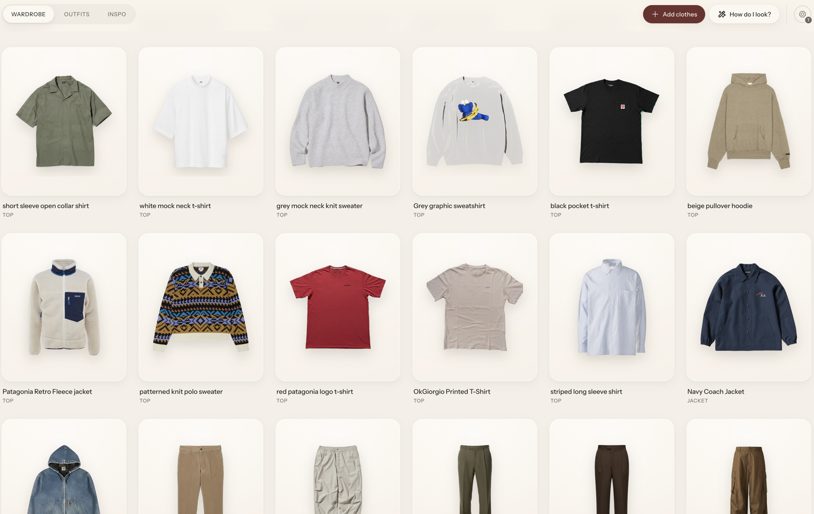

<div align="center">

# Wardrobe

Your clothes, extracted and organized with AI.

[](LICENSE)
[](package.json)

[See the original post →](https://x.com/cdngdev/status/2076812846793650485)

</div>

## About the original project

This is a fork of [tandpfun/wardrobe](https://github.com/tandpfun/wardrobe), a local-first app with a simple idea: drop in a photo of a clothing item, let AI cut it out into a clean product shot, and generate an editorial photo of you wearing it. Everything — originals, cutouts, and the wardrobe database — stays on your machine.




The original does three things well:

- Detects every garment in a photo with an AI vision model
- Extracts a clean product cutout from it
- Generates an optional modeled editorial preview of you wearing it

Full credit to [@cdngdev](https://x.com/cdngdev) for the original idea and implementation — this fork builds on top of it.

## What this fork adds

The core import pipeline above is still here, but this fork turns it into a full styling app.

**Style tools**

- **Outfits** — combine wardrobe pieces (top, bottom, jacket, shoes, socks, accessory) into saved looks, previewed as a flat lay that reveals a scattered editorial layout on hover. Generate a modeled photo of the full outfit, in Standard or Premium quality, and refine it with a free-text note ("jacket should be darker") to regenerate.
- **Suggest outfits** — pick an occasion (casual, work, date, sport, event) and get 3–5 AI-generated combinations pulled from your own wardrobe, each with reasoning about color harmony, weather, and occasion fit. It factors in live local weather and your style profile from Inspo. One click saves a suggestion as a real outfit.
- **Inspo** — one board for style inspiration and the wishlist pieces detected from it. Paste image URLs or drag in photos from anywhere to save a full look; a "Detect items" action analyzes it and breaks it down into individual garment cutouts. Browse by category — Full Look for the saved photos, or any garment type for the pieces detected out of them.
- **My Colors** — a quick seasonal color-analysis quiz (undertone + contrast) that assigns you a season palette, refinable by extracting colors from your own photos. Matching wardrobe items get a badge, and it feeds into outfit suggestions.

**AI & providers**

- **Choice of provider** — the original shipped on OpenAI only; this fork adds **Gemini** (with a free tier via Google AI Studio) and **MiniMax** as full alternatives, configurable with `AI_PROVIDER`.
- **Gemini TEST/PROD mode** — a header toggle that switches between a free, unbilled key for everyday use and a billed key for higher-quality output, with no restart needed.
- **Face reference photo** — an optional close-up face/shoulders photo, sent alongside the full-body reference to sharpen facial identity across generations.
- **Outfit-level and item-level modeled photos** — Standard vs. Premium quality tiers, with regeneration notes.

**Getting set up**

- **In-dashboard onboarding wizard** — on a fresh clone, the app now walks you through picking a provider, saving your API key, and dropping in a reference photo, right in the browser. No hand-editing `.env` or restarting anything yourself — see [Quick start](#quick-start).
- **Bulk import script** (`scripts/bulk-import.mjs`) — import a whole folder of old photos in one run, with dedup across photos.
- **Codex skills** (`$import-clothes`, `$generate-outfits`) — hands-off importing and outfit generation for agentic setups.

## Quick start

```bash
git clone https://github.com/tandpfun/wardrobe.git
cd wardrobe
npm install
npm run dev
```

Open [localhost:5173](http://localhost:5173). On a fresh clone, a setup wizard opens automatically:

1. **Choose a provider** — Gemini is recommended to start, since [Google AI Studio](https://aistudio.google.com/apikey) gives a free key with no billing attached.
2. **Add your key** — pasted into the wizard, saved straight into `.env` on your machine, dev server restarts itself.
3. **Drop in a reference photo** — a clear, full-body photo of yourself (a face close-up is optional but recommended).

That's it — the importer unlocks and you can drag, paste, or choose a photo to bring in your first piece. Reopen the wizard any time from the gear icon in the header, to switch providers, add a face reference, or check your setup.

Prefer to do it by hand? Copy `.env.example` to `.env`, add `OPENAI_API_KEY` (or your provider's key), and place a PNG reference photo at `data/model-reference.png` — the wizard is just a friendlier way to do the same thing.

## Import with Codex

This repo includes two Codex skills: one imports clothes and generates modeled item photos; the other styles complete outfits and generates a modeled lookbook.

```text
$import-clothes Import the clothes from ~/Pictures/outfits, create modeled photos, and add them to this wardrobe.
$generate-outfits Create modeled outfit ideas from my wardrobe.
```

Open the cloned repo in Codex and run either prompt. The import skill asks for a local model-reference PNG when needed, reviews every cutout and modeled photo, then writes to `data/library.json` and `data/imported/`. The outfit skill asks how many looks to create, then curates, generates, verifies, and saves the complete collection under `data/`.

### For agents

If you are setting up Wardrobe for a user, ask how they want to import their clothes:

- **Codex:** Ask for a folder or camera-roll location and a model-reference PNG, then extract, model, and import the individual pieces by following [the bundled import skill](.agents/skills/import-clothes/SKILL.md). Afterward, offer to create a requested number of modeled looks with [the outfit-generation skill](.agents/skills/generate-outfits/SKILL.md).
- **Web UI:** Point the user at the in-dashboard setup wizard (opens automatically on a fresh clone, or from the gear icon), then let them import through the app.
- **Any other agent (no Codex available):** Run `scripts/bulk-import.mjs` (see below) — it does the same folder-of-photos → deduplicated wardrobe workflow without depending on Codex's built-in `imagegen` tool.

## Bulk import without Codex

`scripts/bulk-import.mjs` imports a whole folder of outfit photos in one run, using the same `AI_PROVIDER`/`OPENAI_*`/`GEMINI_*` settings as the web app. It detects every garment in every photo, uses one extra AI call to spot the same physical item worn in multiple photos (so it isn't imported twice), generates cutouts (and modeled photos, if `data/model-reference.png` exists), and writes straight into `data/library.json`.

```bash
npm run bulk-import -- --input ~/Pictures/old-wardrobe-photos --dry-run
npm run bulk-import -- --input ~/Pictures/old-wardrobe-photos
```

Run with `--dry-run` first to see what would be imported without writing anything. See `npm run bulk-import -- --help` for all options.

## Configuration

The setup wizard covers the essentials (`AI_PROVIDER` and the matching key, plus the reference photo). Everything below is available for hand-tuning in `.env`.

| Variable | Default |
| --- | --- |
| `AI_PROVIDER` | `openai` (or `gemini`, `minimax`) |
| `OPENAI_API_KEY` | Required if `AI_PROVIDER=openai` |
| `OPENAI_VISION_MODEL` | `gpt-5.4-mini` |
| `OPENAI_IMAGE_MODEL` | `gpt-image-2` |
| `OPENAI_IMAGE_QUALITY` | `high` |
| `GEMINI_API_KEY_TEST` | Required for TEST mode if `AI_PROVIDER=gemini` |
| `GEMINI_API_KEY_PROD` | Required for PROD mode if `AI_PROVIDER=gemini` (falls back to `GEMINI_API_KEY`) |
| `GEMINI_API_KEY` | Legacy alias for `GEMINI_API_KEY_PROD` |
| `GEMINI_VISION_MODEL` | `gemini-3.6-flash` |
| `GEMINI_IMAGE_MODEL` | `gemini-2.5-flash-image` |
| `GEMINI_IMAGE_SIZE` | `1K` |
| `MINIMAX_API_KEY` | Required if `AI_PROVIDER=minimax` |
| `MINIMAX_API_BASE_URL` | `https://api.minimax.io/v1` |
| `MINIMAX_IMAGE_MODEL` | `image-01` |
| `MINIMAX_IMAGE_RESPONSE_FORMAT` | `base64` |
| `MINIMAX_IMAGE_ASPECT_RATIO` | Optional; takes priority over the stage's width/height |
| `MINIMAX_PROMPT_OPTIMIZER` | `false` |
| `MINIMAX_IMAGE_SEED` | Optional integer seed |
| `WARDROBE_MODEL_REFERENCE` | `data/model-reference.png` |
| `WARDROBE_FACE_REFERENCE` | `data/model-reference-face.png` (optional) |
| `WARDROBE_DATA_DIR` | `data` |

Set `AI_PROVIDER=gemini` to run the import pipeline on Gemini instead of OpenAI. `gemini-2.5-flash-image` ("Nano Banana") has a free tier (up to 500 images/day via a [Google AI Studio](https://aistudio.google.com/apikey) key, no credit card). For higher-quality output at a small per-image cost, set `GEMINI_IMAGE_MODEL` to `gemini-3.1-flash-image` or `gemini-3-pro-image` ("Nano Banana 2" / "Nano Banana 2 Pro").

### Face consistency

Modeled photos are only as good as the identity signal the model gets. `data/model-reference.png` is usually a full-body shot, so the face ends up as a tiny fraction of the frame — often the real reason a generated face drifts between generations. If a PNG exists at `WARDROBE_FACE_REFERENCE` (default `data/model-reference-face.png`, a close crop of the head and shoulders), it's automatically sent as an extra reference image alongside the full-body photo, and the prompt is adjusted to treat it as the primary source for facial identity. It's optional and silently skipped if absent — the setup wizard's second dropzone is the easiest way to add one.

Set `AI_PROVIDER=minimax` to run the garment and modeled-photo image generation through MiniMax's `/v1/image_generation` endpoint instead. Reference images (the garment, or the model photo plus garments) are mapped to `subject_reference`; both `url` and `base64` response formats are decoded into the same review pipeline. Use `https://api.minimaxi.com/v1` for the China endpoint, and set `MINIMAX_GARMENT_MODEL` / `MINIMAX_MODELED_MODEL` to override `MINIMAX_IMAGE_MODEL` per stage. Clothing detection and outfit-style analysis still use the OpenAI vision model regardless of `AI_PROVIDER`.

### TEST / PROD mode

When `AI_PROVIDER=gemini`, the app header shows a TEST/PROD toggle (persisted server-side, no restart needed). TEST mode calls Gemini with `GEMINI_API_KEY_TEST` and refuses to run the paid "premium" model photo tier — point that key at a Google Cloud project with **no billing account attached** so it's free-tier-only and physically can't be charged, even by mistake. PROD mode uses `GEMINI_API_KEY_PROD` (or the legacy `GEMINI_API_KEY`) and unlocks the premium tier. The mode defaults to PROD so existing single-key setups keep working; the setup wizard switches you to TEST automatically if that's the only key you give it.

## License

[MIT](LICENSE)
